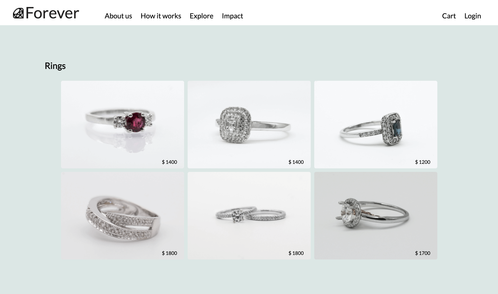

# Schmuckprojekt: One-Pager mit Flexbox

## Übersicht

In diesem Projekt war die Aufgabe, eine One-Pager-Seite für Schmuck (Ringe) zu erstellen. Der Fokus lag dabei darauf, die **Flexbox**-Eigenschaften zu nutzen, um eine ansprechende Layoutstruktur zu erstellen. **Responsive Design** war in diesem Projekt noch nicht im Fokus, und es wurden keine Media Queries verwendet. Stattdessen stand die grundsätzliche Beherrschung von `display: flex` und dessen Eigenschaften im Vordergrund.

---

# Vorschau


## Anforderungen

- **Thema:** Ringe (Schmuck)
- **Technologie:** Flexbox
- **Bilder:** Integration von Schmuckbildern
- **Ziel:** Eine strukturierte und optisch ansprechende Seite ohne Responsivität.

---

## Verwendete Techniken

### HTML
- Strukturierung der Seite mit `header`, `main`, und `footer`.
- Einbindung von Bildern und Texten.
- Erstellung einer Navigation mit Links.

### CSS
- Einsatz von `display: flex`, um:
  - Navigationselemente horizontal auszurichten.
  - Eine gleichmäßige Verteilung der Bilder zu gewährleisten.
- Grundlegendes Styling (Farben, Abstände, Schriftarten).

---

## Projektstruktur

```plaintext
project-folder/
├── index.html
├── styles.css
├── images/
│   ├── ring1.jpg
│   ├── ring2.jpg
│   ├── ring3.jpg
│   ├── ring4.jpg
│   ├── ring5.jpg
│   ├── ring6.jpg
```

## Lernziele

	•	Verständnis der grundlegenden Eigenschaften von Flexbox:
	•	justify-content
	•	align-items
	•	flex-wrap
	•	Anwendung von Flexbox zur Strukturierung von Elementen.
	•	Grundlegendes Verständnis von CSS-Styling für Layouts und Bilder.


